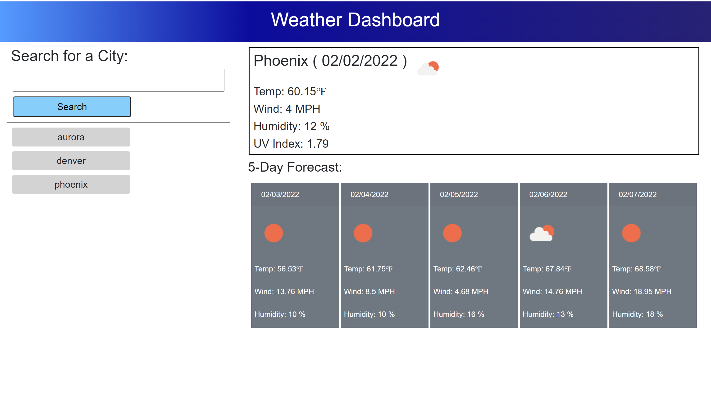

# DU-HW6-Weather-Dashboard

DU Coding Bootcamp Homework 6: Weather Dashboard

# Website

This is a website with dynamically updated content via JavaScript. It writes to local storage and does not have functionality built in to clear the local storage objects. It accesses content via API calls to external servers.

Public Website Address: https://gittinit6.github.io/DU-HW6-Weather-Dashboard/

## Purpose

This website is specific to anyone that wants to view the current and 5-day forecast for a given city.

* City and Date
* Temperature in Fahrenheit
* Wind speed in MPH
* Humidity
* UV Index

## Audience

The intended audience is an individual that would have a need to see a weather forecast. The user of this site does not need to have a technical background.

## Technical Detail

This website uses HTML with an external linked CSS for style and external linked JavaScript code for functionality. It uses bootstrap for grid and cards, and moment for calculating time. Data is accessed via API call to api.openweathermap.org to convert city name to coordinates (lat,lon) and pull weather data.

**Responsive Design:** This website is designed to be responsive to smaller screens.

The files are configured as follows:
```
Root Directory
│
│ --index.html
│
└───assets (folder)
    │
    └─── css (folder containing css style files)
    │
    └─── images (folder containing all image resources)
    │
    └─── scripts (folder containing JavaScript files)

External Resources
[bootstrap]
[moment]
[api.openweathermap.org]
```
>**CSS**: This site uses a single CSS file "style.css"

>**JavaScript**: This site uses a single JavaScript file "script.js"

>**Bootstrap**: This site uses grid fuctionality within bootstrap

>**Moment**: This site uses moment to calculate time

>**API**: This site uses api.openweathermap.org data and functionality

The following image shows a screenshot of the website homepage:



## Revision History 

1. This website was created in February 2022 as part of a bootcamp assignment. It was created from scratch and edited using Visual Studio Code.